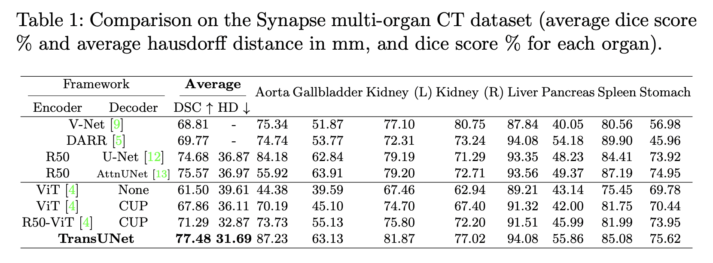
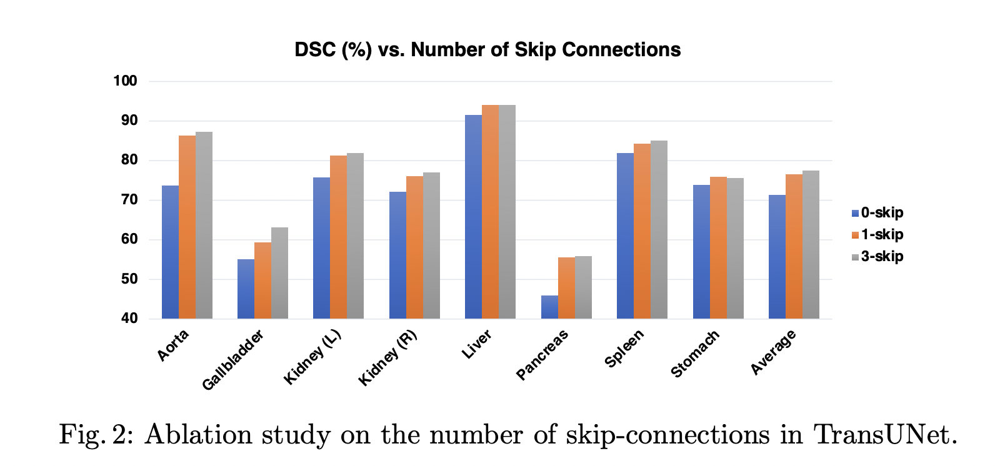
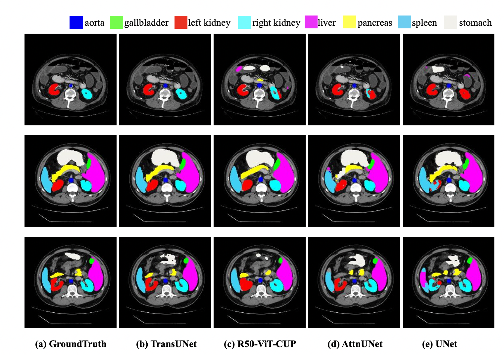
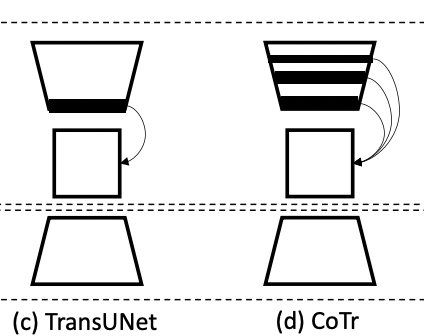

Naively using the transformer does not yield satisfactory result.

- Encode tokenized image patches and directly upsample? No!
- Transformers treat the input as 1D sequences -> only focuses on global context -> low resolution features lack detailed localization information.

애초에 low resolution feature 이 소실되었는데, 이걸 upsample 해봐야 무슨 소용이 있는가?

But, we know CNN architectures are an expert in extracting low-level features.

-> **Hybrid CNN-Transformer** for 일석이조. CNN 에서 추출한 feature들은 skip-connection 을 써서 뽕뽑아먹자.

## Architecture

### Encoder

먼저 CNN Architecture (논문에선 ResNet-50 활용) 을 통해 feature 추출. 이 때 각각의 layer들은 skip connection으로 활용.

그 후 최종 feature을 ViT의 input으로 활용.

</img>
  
지긋지긋한 ViT...

마지막 feature 을 patch로 나눠서 spatial encoding 을 넣어준 뒤, ViT의 Transformer Layer을 12번 반복한다.

### Decoder

HW/P^2 -> H/P x W/P 로 reshape 후, 1x1 convolution 을 사용해서 channel 수를 number of classes 로 줄임

Bilinear upsampling 대신 cascaded upsampler (CUP) 활용

Upsampler:
  - Upsampling operator x 2
  - 3x3 Convolution layer
  - ReLU layer
  - Skip connection 은 concatenation

총 4번의 upsampling을 통해 (512, H/16, W/16) -> (16, H, W) 로 recover

## Experiments

Dataset: 30 abdominal CT scans in the MICCAI 2015 Multi-Atlas Abdomen Labeling Challenge, with 3779 axial contrast-enhanced abdominal clinical CT images in total.

</img>
  
Table 1. Comparison on Synapse multi-organ CT dataset

1. Number of Skip connections

0: None
1: only at 1/4 to 1/4
3: all 1/2, 1/4, 1/8

</img>
  
Fig 2. ablation study on # of skip-connections

*Note. performance increase is more evident on smaller organs: aorta (대동맥), gallbladder (담낭), ...*

2. Input Resolution

224x224 -> 512x512 로 올렸을 때 6.88% 향상.

연산량이 너무 많아져서 이 논문에선 default 224x224로 실험.

3. Patch size

Smaller patch size가 더 좋은 성능 (ViT때도 그랬듯이..)

default: 16

4. Model size

Base vs Large

- Hidden size: 12 / 24
- number of layers: 768 / 1024
- MLP size: 3072 / 4096
- Number of heads: 12 / 16

Average DSC 77.48 -> 78.52 (1.04% increase)

5. Implementation details

- SGD Optimizer
- lr=0.01, momentum=0.9, weight decay=1e-4
- batch size=24
- Single RTX2080Ti GPU

6. Qualitative comparison

</img>
  
Fig 3. Qualitative comparison

## Limitations

But... 어차피 CNN의 결과물을 transformer에 넣으면 이미 spatial information은 소실되었는데..?

CoTr에서 해결: establish multiple connections between CNN and Transformer

</img>
  
Fig 2. ablation study on # of skip-connections

Deformable Self-Attention을 적용하여 연산량을 크게 늘리지 않는 선에서 multi-scale and high-resolution feature maps 의 활용을 극대화함.
