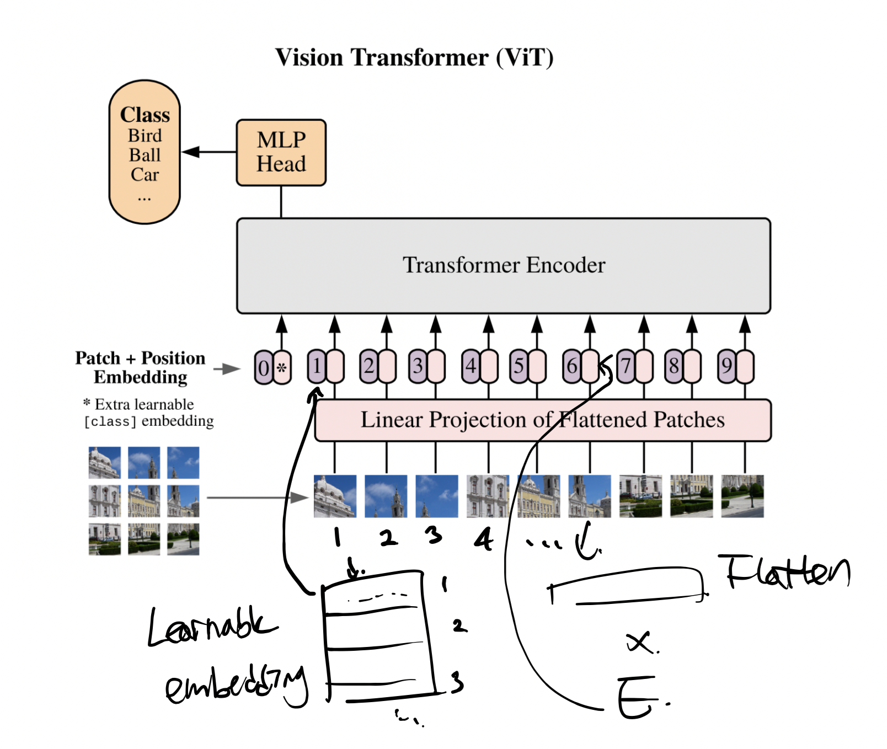

## Significance

First model to fully utilize transformer in image dataset

Done by splitting images into patches (just as tokens)

Vs. ResNet

Lower accuracies in the mid-sized datasets
- Transformers lack inductive biases

Excellent accuracies in larger datasets
- Pre-training at sufficient scale and transfer-learning to specific tasks

## Background

### Inductive Bias

"어떤 작업에 대한 가정이 있으면 더 수월해짐"

CNN - locality
RNN - sequential

ViT 는 상대적으로 intuctive bias가 부족.

### Hybrid Architecture

Resnet놔두고 왜 Image patch를 사용? -> Input을 CNN 의 feature map 으로 대체

모델이 작을 때 유효한 성능 개선을 보이지만, 큰 모델은 별 차이가 없음.

## Architecture

</img>

Let's go patch by patch to get global attention.

</img>

Reshape HxWxC -> Nx(P^2xC), where H*W=P^2*N

## Difference?

</img>

1. Pre-Norm

Layer Normalization을 사용하며, multi-head attention 전에 사용

2. GELU

</img>

MLP의 활성화 함수로 ReLU 대신에 GELU를 사용함

## Experiment

ViT-L/16: Large Model, input patch size 16x16

Smaller patch size requires greater computational power

### Pretraining dataset and performance

</img>

데이터의 규모가 클 수록 무거운 모델이 빛을 발한다

</img>

마찬가지로 90M 이 넘어갈 때 CNN approach 보다 좋은 성능을 낸다. CNN의 장점인 "locality kernel" 이 데이터의 수가 많아지면 무의미해짐을 보여준다.

### Computational cost and performance

</img>

- ViT가 비용대비 성능이 좋음 (Convolution 연산보다 Transformer 연산이 낮은 computational cost를 가진 효과)
- 한정된 비용에선 Hybrid, 자원이 허락한다면 ViT를 사용하는것이 권장됨

## Implementation

https://github.com/lucidrains/vit-pytorch/blob/main/vit_pytorch/vit.py

```python3
import torch
from torch import nn

from einops import rearrange, repeat
from einops.layers.torch import Rearrange

# helpers

def pair(t):
    return t if isinstance(t, tuple) else (t, t)

# classes

class PreNorm(nn.Module):
    def __init__(self, dim, fn):
        super().__init__()
        self.norm = nn.LayerNorm(dim)
        self.fn = fn
    def forward(self, x, **kwargs):
        return self.fn(self.norm(x), **kwargs)

class FeedForward(nn.Module):
    def __init__(self, dim, hidden_dim, dropout = 0.):
        super().__init__()
        self.net = nn.Sequential(
            nn.Linear(dim, hidden_dim),
            nn.GELU(),
            nn.Dropout(dropout),
            nn.Linear(hidden_dim, dim),
            nn.Dropout(dropout)
        )
    def forward(self, x):
        return self.net(x)

class Attention(nn.Module):
    def __init__(self, dim, heads = 8, dim_head = 64, dropout = 0.):
        super().__init__()
        inner_dim = dim_head *  heads
        project_out = not (heads == 1 and dim_head == dim)

        self.heads = heads
        self.scale = dim_head ** -0.5

        self.attend = nn.Softmax(dim = -1)
        self.dropout = nn.Dropout(dropout)

        self.to_qkv = nn.Linear(dim, inner_dim * 3, bias = False)

        self.to_out = nn.Sequential(
            nn.Linear(inner_dim, dim),
            nn.Dropout(dropout)
        ) if project_out else nn.Identity()

    def forward(self, x):
        qkv = self.to_qkv(x).chunk(3, dim = -1)
        q, k, v = map(lambda t: rearrange(t, 'b n (h d) -> b h n d', h = self.heads), qkv)

        dots = torch.matmul(q, k.transpose(-1, -2)) * self.scale

        attn = self.attend(dots)
        attn = self.dropout(attn)

        out = torch.matmul(attn, v)
        out = rearrange(out, 'b h n d -> b n (h d)')
        return self.to_out(out)

class Transformer(nn.Module):
    def __init__(self, dim, depth, heads, dim_head, mlp_dim, dropout = 0.):
        super().__init__()
        self.layers = nn.ModuleList([])
        for _ in range(depth):
            self.layers.append(nn.ModuleList([
                PreNorm(dim, Attention(dim, heads = heads, dim_head = dim_head, dropout = dropout)),
                PreNorm(dim, FeedForward(dim, mlp_dim, dropout = dropout))
            ]))
    def forward(self, x):
        for attn, ff in self.layers:
            x = attn(x) + x
            x = ff(x) + x
        return x

class ViT(nn.Module):
    def __init__(self, *, image_size, patch_size, num_classes, dim, depth, heads, mlp_dim, pool = 'cls', channels = 3, dim_head = 64, dropout = 0., emb_dropout = 0.):
        super().__init__()
        image_height, image_width = pair(image_size)
        patch_height, patch_width = pair(patch_size)

        assert image_height % patch_height == 0 and image_width % patch_width == 0, 'Image dimensions must be divisible by the patch size.'

        num_patches = (image_height // patch_height) * (image_width // patch_width)
        patch_dim = channels * patch_height * patch_width
        assert pool in {'cls', 'mean'}, 'pool type must be either cls (cls token) or mean (mean pooling)'

        self.to_patch_embedding = nn.Sequential(
            Rearrange('b c (h p1) (w p2) -> b (h w) (p1 p2 c)', p1 = patch_height, p2 = patch_width),
            nn.Linear(patch_dim, dim),
        )

        self.pos_embedding = nn.Parameter(torch.randn(1, num_patches + 1, dim))
        self.cls_token = nn.Parameter(torch.randn(1, 1, dim))
        self.dropout = nn.Dropout(emb_dropout)

        self.transformer = Transformer(dim, depth, heads, dim_head, mlp_dim, dropout)

        self.pool = pool
        self.to_latent = nn.Identity()

        self.mlp_head = nn.Sequential(
            nn.LayerNorm(dim),
            nn.Linear(dim, num_classes)
        )

    def forward(self, img):
        x = self.to_patch_embedding(img)
        b, n, _ = x.shape

        cls_tokens = repeat(self.cls_token, '1 n d -> b n d', b = b)
        x = torch.cat((cls_tokens, x), dim=1)
        x += self.pos_embedding[:, :(n + 1)]
        x = self.dropout(x)

        x = self.transformer(x)

        x = x.mean(dim = 1) if self.pool == 'mean' else x[:, 0]

        x = self.to_latent(x)
        return self.mlp_head(x)
```
