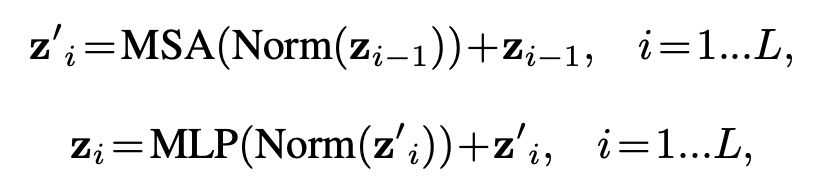
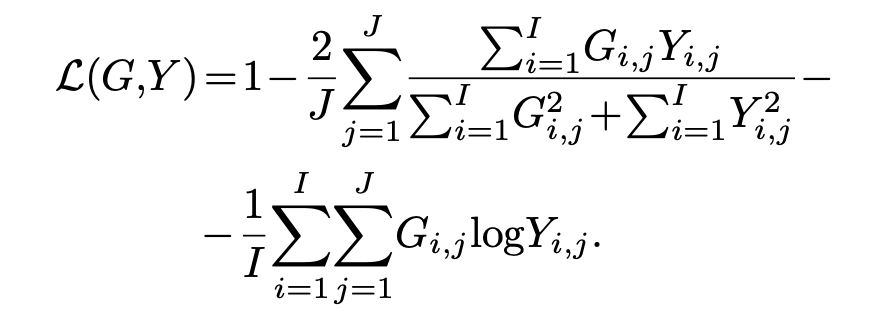

CoTr: 4 March 2021 (first on 3D)

UNETR: 9 Oct 2021

## Background

명목상으론 기존 FCNN 기반 모델의 lack of long-range dependency 를 지적하지만.. 그냥 U-net에 transformer을 빨리 갖다붙이고 싶었던 것 같음.

## Architecture

<div align="center">

  <p>어? 어디서 본것같다.</p>
</div>

<div align="center">
</img>
  <p>ViT 를 그대로 베껴왔다!</p>
</div>

다른 점은 Nx(P^3 \dot C) 개의 patches 로 나누는 것. 그 이후엔 각각의 patch에 linear projection을 하여 embedding layer로 보냄.

ViT와 마찬가지로, spatial information을 위해 learnable positional embedding 을 추가.

Class token은 따로 사용하지 않으며 (segmentation), 12개의 stacked transformer을 지나게 된다.

<div align="center">

  <p>UNETR Architecture</p>
</div>

Multi-head Self Attention, Multi Layer Perceptron은 아래와 같이 정의된다.



이 때, 3의 배수마다 skip connection 을 사용해 decoder의 input으로 활용된다.

Encoder part가 끝나면, feature map에 deconvolution (transpose conv)을 해 resolution을 x2 하고, 이전의 transformer output과 concatenate한다.

## Loss function



1 - soft_dice_loss* - cross_entropy_loss

- I : Voxels
- J : Classes
- Y : Probability (prediction)
- G : Ground Truth

* soft in the sense that probabilities are directly used to compute the loss

## Model comparison

<div align="center">

</div>

## Code

```Python
def forward(self, x_in):
    x, hidden_states_out = self.vit(x_in) # ViT network를 그대로 차용
    enc1 = self.encoder1(x_in)
    x2 = hidden_states_out[3]
    enc2 = self.encoder2(self.proj_feat(x2))
    x3 = hidden_states_out[6]
    enc3 = self.encoder3(self.proj_feat(x3))
    x4 = hidden_states_out[9]
    enc4 = self.encoder4(self.proj_feat(x4))
    dec4 = self.proj_feat(x)
    dec3 = self.decoder5(dec4, enc4)
    dec2 = self.decoder4(dec3, enc3)
    dec1 = self.decoder3(dec2, enc2)
    out = self.decoder2(dec1, enc1)
    return self.out(out)
  
# encoder

def forward(self, x):
    x = self.transp_conv_init(x)
    for blk in self.blocks:
        x = blk(x)
    return x

# decoder

def forward(self, inp, skip):
    # number of channels for skip should equals to out_channels
    out = self.transp_conv(inp)
    out = torch.cat((out, skip), dim=1)
    out = self.conv_block(out)
    return out

# output

self.out = UnetOutBlock(spatial_dims=spatial_dims, in_channels=feature_size, out_channels=out_channels)

class UnetOutBlock(nn.Module):
    def __init__(
        self, spatial_dims: int, in_channels: int, out_channels: int, dropout: Optional[Union[Tuple, str, float]] = None
    ):
        super().__init__()
        self.conv = get_conv_layer(
            spatial_dims, in_channels, out_channels, kernel_size=1, stride=1, dropout=dropout, bias=True, conv_only=True
        )

    def forward(self, inp):
        return self.conv(inp)
```

이 때, DynUnet 이라는 처음 보는 네트워크의 block을 차용하는데, DynUnet은 nnUnet을 MONAI에서 쓸 수 있게 implement한 것이다.


## Dataset


[BTCV Challenge Dataset](https://www.synapse.org/#!Synapse:syn3193805/wiki/217752)

"50 abdomen CT scans randomly selected from a combination of an ongoing colorectal cancer chemotherapy trial, and a retrospective ventral hernia study."

## Implementation Details
- Batch size: 6
- Optimizer: AdamW
- Learning rate: 0.0001
- Iteration: 20000
- Backbone: ViT-B16
- L=12, K=768, P=16×16×16 (32 일때와 비교하여 약간의 성능향상이 있었다)
- Augmentation: Random rotation(90°, 180°, 270°), Random flip(axial, sagittal, coronal views), Random scale, Shift intensity
- Ensemble: Five-fold cross-validation

[Official Code](https://github.com/Project-MONAI/research-contributions/tree/main/UNETR/BTCV)
